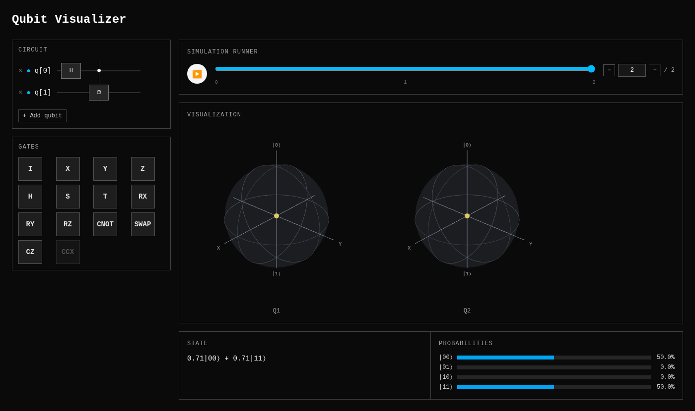

# Qubit Visualizer

An interactive quantum circuit builder that visualizes qubit states in
real time on Bloch spheres — entirely in the browser, no backend.



*A Bell state (`H` then `CNOT`) — both qubits collapse to the center of
their Bloch spheres, visualizing entanglement via the reduced density
matrix.*

## Features

- **14 quantum gates** — Pauli (`X`/`Y`/`Z`), `H`, `S`, `T`, rotations
  (`RX`/`RY`/`RZ`), and multi-qubit gates (`CNOT`, `SWAP`, `CZ`, `CCX`) —
  each with a hover tooltip explaining what it does
- **Live Bloch sphere visualization**, one draggable, rotatable sphere per
  qubit (up to 10 qubits, arranged 5 per row)
- **Entanglement made visible** — an entangled qubit's Bloch vector
  shrinks toward the center instead of pointing to a single pure state
- **Step-by-step simulation runner** — scrub, play/pause, or jump directly
  to any step in the circuit's history
- **State vector and probability breakdown** for the current step
- **Share a circuit via URL** — click Share to copy a link that encodes the
  whole circuit; opening it reconstructs it exactly, no account or server
  needed
- Click anywhere on a qubit's wire to append the armed gate — no
  scrolling to find a tiny target on long circuits

## Stack

Vite, React, TypeScript, TanStack Router, Tailwind CSS v4, Three.js
(`@react-three/fiber` + `@react-three/drei`), Zustand. All state-vector
simulation runs client-side — there's no server and no database.

## Getting started

```bash
npm install
npm run dev       # start the dev server
npm run build     # typecheck and build for production
npm run test      # run the test suite
npm run lint      # lint with oxlint
```

## How it works

- Each qubit is a 2-element complex vector; gates are 2×2 (or 4×4 for
  two-qubit gates) unitary matrices applied via matrix multiplication.
- Add, remove, enable, or disable qubits dynamically — the visualization
  updates to match.
- The simulation runner keeps a full step-by-step history, so you can
  scrub back through a circuit's execution, not just watch the end state.
